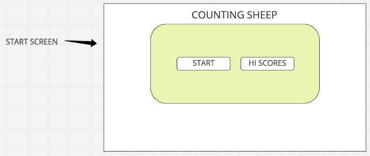
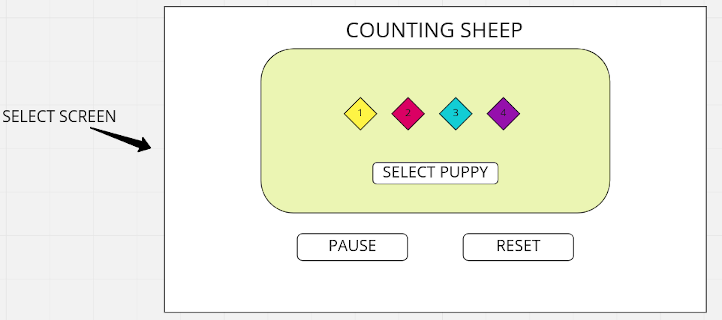
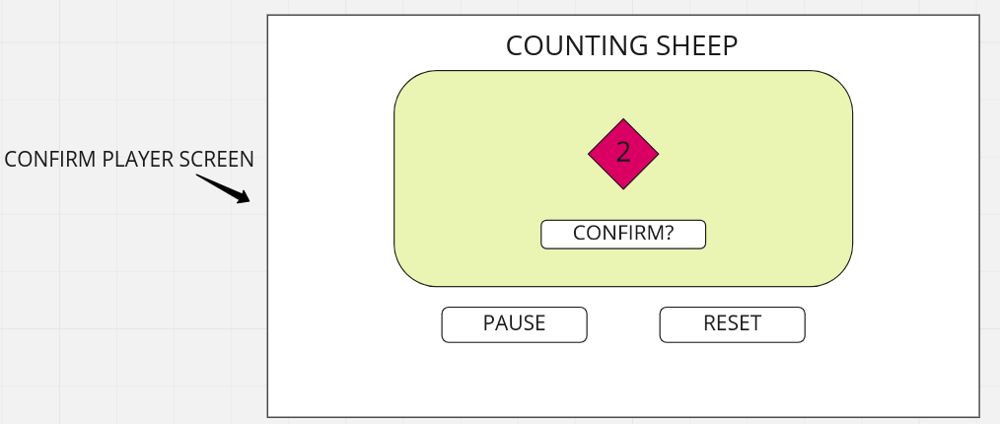
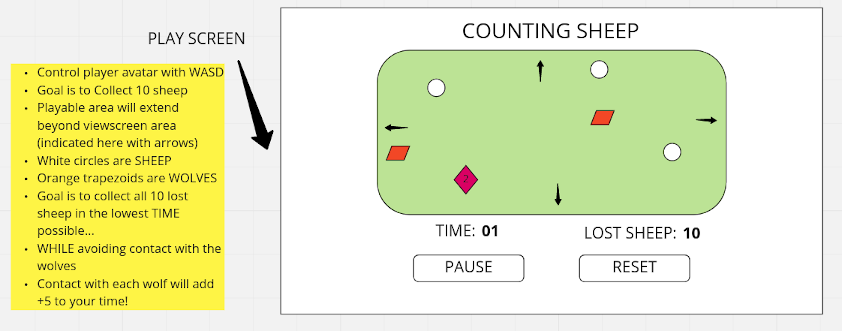
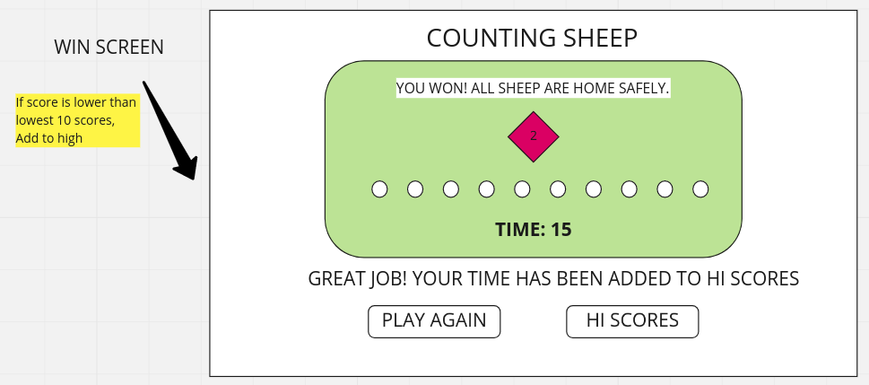
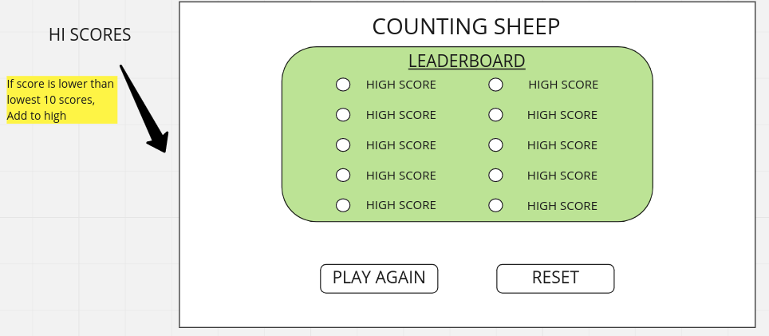

<h1>COUNTING SHEEP: A HERDING TALE</h1>
<h2>USER STORY</h2>
<ul>
<li>User is presented with two options on page load: START and LEADERBOARD</li>
    
<li>On 'START', selection screen begins</li>
    
<li>User presented with opening selection screen to choose their avatar</li>
<li>Once selected, button pops up to confirm?</li>
    
<li>On click of confirmation button, gameLoop begins</li>
    
<li>Reset button shows up at the bottom</li>
<li>If clicked, reset button takes the player back to the START and LEADERBOARD screen</li>
<li>The premise of the game is you control a lil corgi dog that has to "collect" sheep</li>
<li>it's a time trial! you're competing against yourself! </li>
<li>Final timer marks are saved to a High Score leaderboard.</li>
<li>Game is played on HTML Canvas</li>
<li>Background of image is going to be a bucolic pixel art background image</li>
<li>Player controls their little avatar using WASD keydown</li>
<li>On spacebar keydown, 'bark' soundeffect will trigger. (no purpose to it, just fun!)</li>
<li>10 sheep will be populated on the map (randomly????)</li>
<li>On collision of sheep and corgi, the sheep will BAAA (trigger baa sound effect) and disappear.</li>
<li>Once all 10 sheep have been collected: win condition TRUE; 'YOU WON!' message shows up, (player sprite idle animation plays)</li>

<li>Player score is added to leaderBoard (if within lowest 10 timer #s)</li>
<li>OnScreen will also be displayed two buttons: PLAY AGAIN and VIEW LEADERBOARD</li>
<li>PLAY AGAIN takes player to selection screen, same as start</li>
<li>VIEW LEADERBOARD takes player to leaderboard, which has lowest scores (total leaderboard scores >= 10 scores)</li>

</ul>

<h2>STRETCH GOALS:</h2>
<ul>
<li>DONE! Sprites as avatars.</li>
<li>DONE! Animated win screen.</li>
<li>DONE! PERSISTENT LEADERBOARD (https://blog.logrocket.com/localstorage-javascript-complete-guide/)</li>
<li>Animate sprites through movement frames in-game</li>
<li>Potential: have the wolf chase you?</li>
    <ul>
        <li>Add'l stretch goal: be able to set difficulty by increasing movement speed for wolf!</li>
    </ul>
</ul>

<h2>TECHNOLOGIES USED:</h2>
<ul>
<li>HTML, CSS, JavaScript</li>
</ul>

<h2>APPROACH TAKEN:</h2>
<ul>
<li>Create basic timer to track time</li>
<li>Set up gameLoop to handle animation</li>
<li>Create general gameLoop and collision detection</li>
<li>On collision, sheep disappear</li>
<li>Then implemented select screen and player select</li>
<li>Created animated win screen</li>
<li>Hooked up leaderboard to local storage</li>
<li>Implemented wolf which resets the player on collision</li>
</ul>

<h1>ATTRIBUTION:</h2>
<ul>
<li>Sheep asset courtesy: https://bobkatt.itch.io/</li>
<li>Background music courtesy: https://soundcloud.com/alexandr-zhelanov (https://opengameart.org/content/casual-game-track)</li>
<li>Corgi sprites courtesy: https://angryelk.itch.io/animated-corgi-sprite</li>
<li>Background image tileset courtesy: https://ojas-sabadra.itch.io/pixelworld </li>
<li>Wolf grunt courtesy: https://opengameart.org/content/dog-grunt</li>
<li>Dog bark courtesy: Mixkit Sound Effects Free License</li>
</ul>

