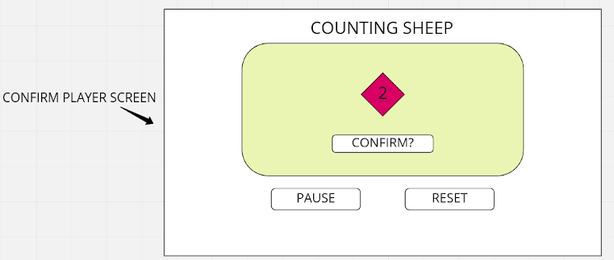

USER STORIES
// user is presented with two options on page load: START and LEADERBOARD
    
// on 'START', selection screen begins
    
// user presented with opening selection screen to choose their avatar
// once selected, button pops up to confirm? 
    
// on click of confirmation button, gameLoop begins
    
// Reset button shows up at the bottom
// If clicked, reset button takes the player back to the START and LEADERBOARD screen
// premise of the game is you control a lil corgi dog that has to "collect" sheep
// it's a time trial! 
// you're competing against yourself! 
// final timer marks are saved to a High Score leaderboard?
// game is played on Canvas (html)
// background of image is going to be a bucolic pixel art background image
// player controls their little avatar using WASD keydown
// on spacebar keydown, 'bark' soundeffect will trigger. (no purpose to it, just fun!)
// 10 sheep will be populated on the map (randomly????)
// on collision of sheep and corgi, the sheep will BAAA (trigger baa sound effect), jump up and down(?), and then fade away in 5sec (to return home)
// once all 10 sheep have been collected: win condition TRUE; 'YOU WON!' message shows up, (player sprite idle animation plays)

// player score is added to leaderBoard (if within lowest 10 timer #s)
// OnScreen will also be displayed two buttons: PLAY AGAIN and VIEW LEADERBOARD
// PLAY AGAIN takes player to selection screen, same as start
// VIEW LEADERBOARD takes player to leaderboard, which has lowest scores (total leaderboard scores >= 10 scores)

STRETCH GOALS:
// animate sprites through movement frames
// Wolves (other obstacles) that you need to avoid
    // 10 wolves will also be populated on the map (randomly???) and will move randomly (not much)
    // stretch goal: be able to set difficulty by increasing movement speed and movement distance for wolves
    // on collision of wolf and corgi, 'snarl' sound effect will trigger and the player's time will have 5 seconds added to it!
// PERSISTENT LEARDERBOARD

TECHNOLOGIES USED:
- HTML, CSS, JavaScript

APPROACH TAKEN:

KNOWN BUGS/TO FIX:
// If two sheep populate on top of each other, it can mess with the collision detection, creating an immortal sheep

ATTRIBUTION:
Sheep asset courtesy: https://bobkatt.itch.io/
Background music courtesy: https://soundcloud.com/alexandr-zhelanov (https://opengameart.org/content/casual-game-track)
Corgi sprites courtesy: https://angryelk.itch.io/animated-corgi-sprite
Sheep sprites courtesy: Attribute to Daniel Eddeland (https://opengameart.org/content/lpc-style-farm-animals)
Background images courtesy: https://opengameart.org/content/the-field-of-the-floating-islands

